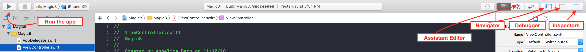
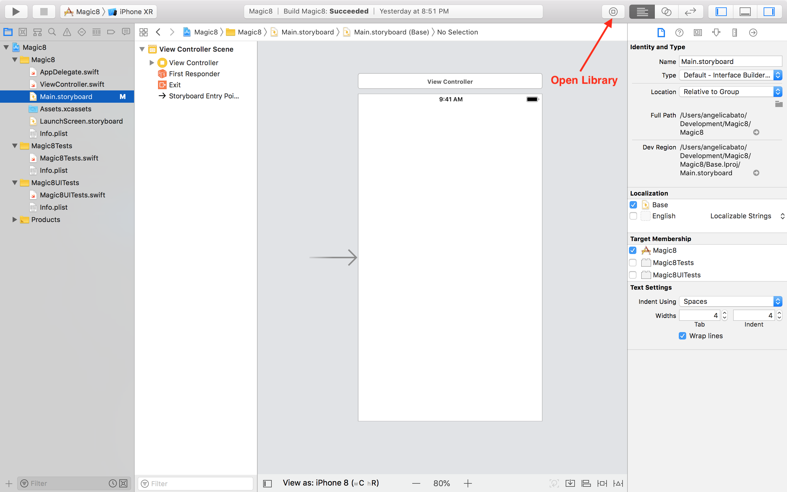
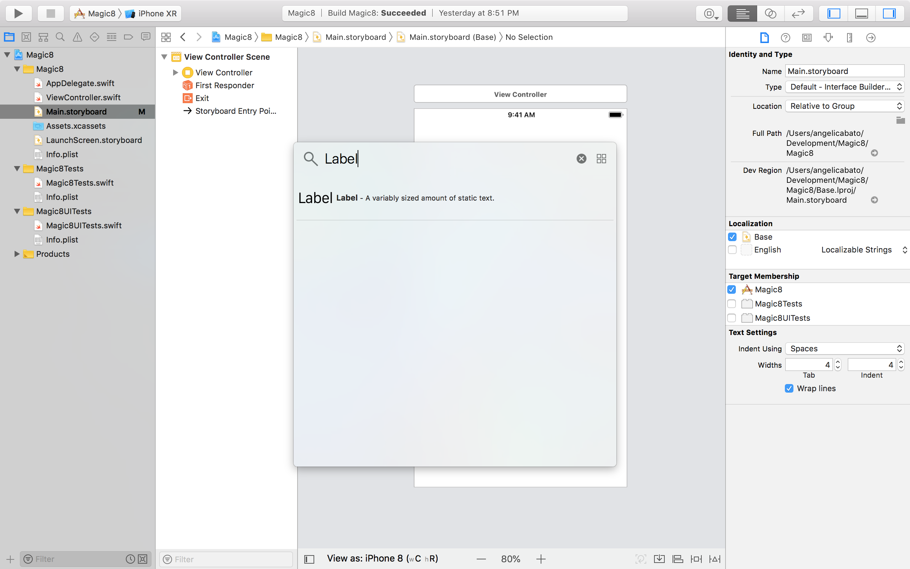
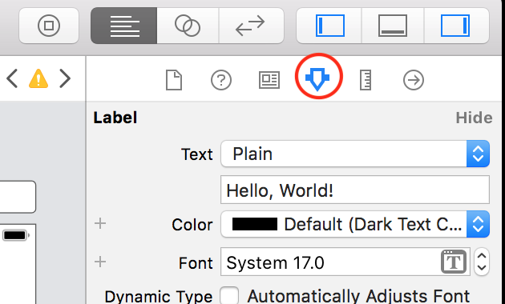
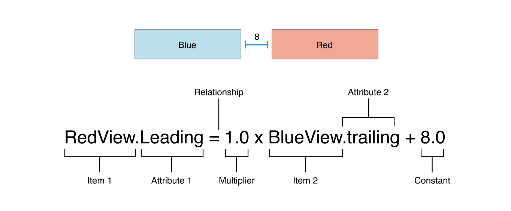
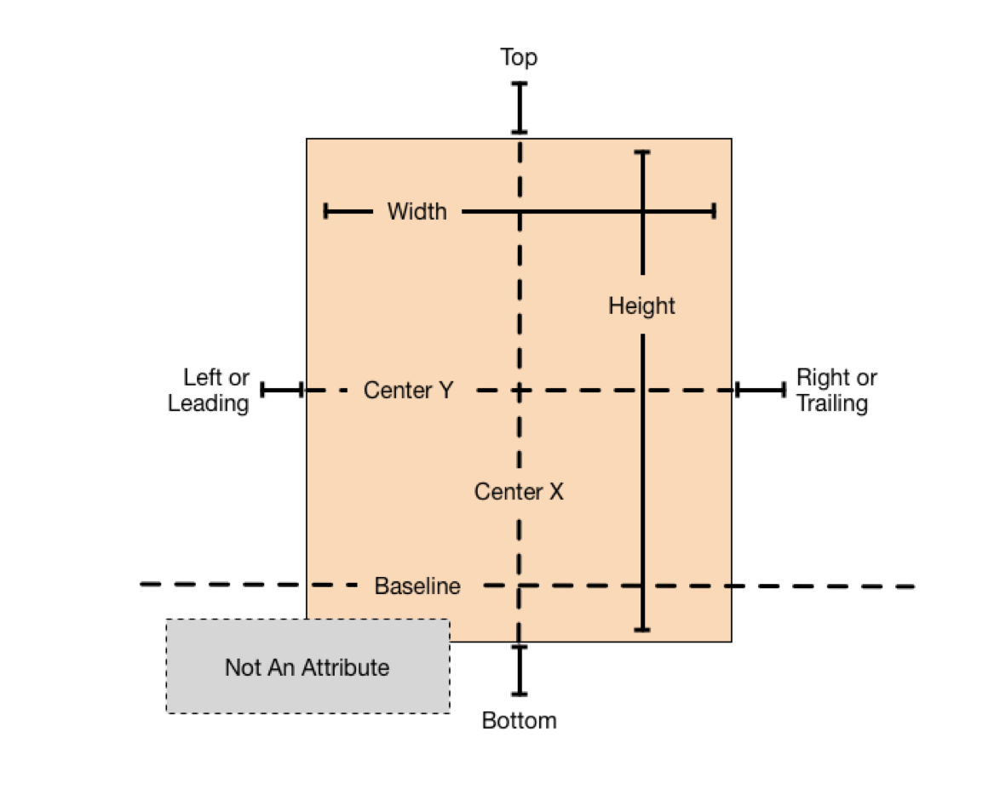
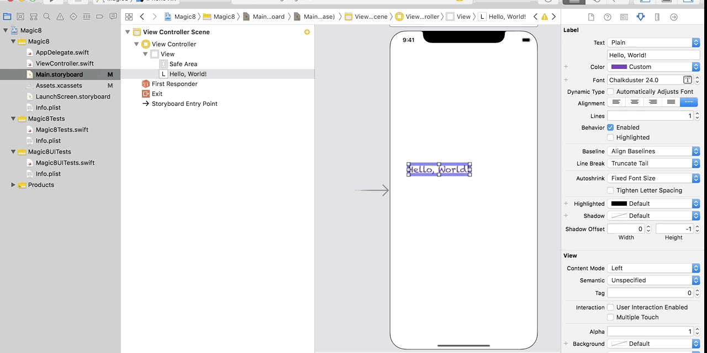
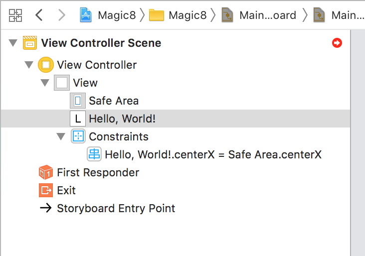
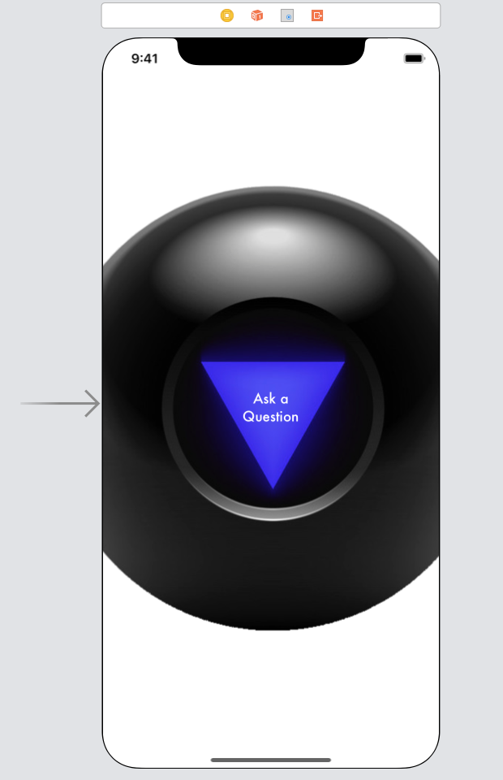

# iOS Workshop - Contents

This workshop will walk you through some very basic Swift and help you explore Xcode, storyboards, and view controllers. This will be self-paced.

Environment Requirements:
* Make sure you have Xcode 10.1 installed
* Make sure you have access to `Fundamentals.playground` and `Magic8.xcodeproj`. 

<!-- TOC -->

- [iOS Workshop - Contents](#ios-workshop---contents)
- [Swift Fundamentals](#swift-fundamentals)
    - [`let` vs. `var`](#let-vs-var)
        - [__Exercise 1__](#exercise-1)
    - [Data types](#data-types)
        - [Integers](#integers)
        - [__Exercise 2__](#exercise-2)
        - [Floats](#floats)
        - [Boolean](#boolean)
        - [Strings](#strings)
        - [__Exercise 3__](#exercise-3)
    - [Collection Types](#collection-types)
        - [Arrays](#arrays)
        - [__Exercise 4__](#exercise-4)
        - [__Exercise 5__](#exercise-5)
        - [Dictionaries](#dictionaries)
    - [For-loops](#for-loops)
        - [__Exercise 6__](#exercise-6)
    - [Functions](#functions)
        - [Anatomy of a function](#anatomy-of-a-function)
        - [__Exercise 7__](#exercise-7)
    - [Learn more Swift](#learn-more-swift)
- [Storyboards](#storyboards)
    - [Tools](#tools)
    - [Build your first view](#build-your-first-view)
    - [Constraints](#constraints)
        - [Anatomy of a constraint](#anatomy-of-a-constraint)
    - [Build the Magic 8 Ball](#build-the-magic-8-ball)
        - [Set up the view](#set-up-the-view)
        - [Set up the logic](#set-up-the-logic)

<!-- /TOC -->

# Swift Fundamentals
Open `Fundamentals.playground` to follow along with Exercises.

## `let` vs. `var`
There are two ways you can initialize a variable: using `let` and `var`

`let` makes the value *immutable*, meaning it cannot be changed after it has been initialized

`var` makes the value *mutable* -- you can reassign this variable as many times as you want.

```swift
var myNum = 1
myNum = 2 + 3
print(myNum)  // 5

let myImmutableNum = 1
myImmutableNum = 2 + 3 // ??
```
-------
### __Exercise 1__
<em>What happens if you try to reassign a `let` variable?</em>

-------
## Data types
### Integers
Integers are a primitive value type that represents a non-fractional number. This means only whole numbers. All mathematical operations with integers will result in an integer.
```swift
let myInteger: Int = 1
print(myInteger - 1) // 0
```
------
### __Exercise 2__
What happens if you divide `myInteger` with 2?

------

### Floats
Floats are a primitive value type that represents a fractional number. Any math with floats will result in a float.
```swift
let myFloat: CGFloat = 1.0
print(myFloat / 2) // 0.5
```
### Boolean
Boolean is a value type that can only hold `true` or `false`.
```swift
let myBool: Bool = myFloat > 0.5
print(myBool) // true
```
### Strings
Strings are any series of characters.
```swift
let myStr = "My name is Angelica"
print(myStr) // "My name is Angelica"
```
You can add them together
```swift
let firstPart = "Hello"
let secondPart = "Angelica"
let fullStr = firstPart + ", " + secondPart 
print(fullStr) // Hello, Angelica
```

You can pull substrings from them
```swift
let myString = "Hello everyone"
let subStr = myString.prefix(5) // Hello
let otherSubStr = myString.suffix(8) // everyone
```
-----
### __Exercise 3__
Print out a string that says "Hello, world!"

-----

## Collection Types
There are several ways to represent a collection of data -- two of them being Arrays and Dictionaries.
### Arrays
Arrays are a basic collection type. You can define the type of object that is allowed to be stored within it. The order you place items in the array will matter.

```swift
//Different ways to initialize an array of strings
let arr1: [String] = ["Foo", "Bar", "Baz"]
let arr2: Array<String> = ["Foo", "Bar", "Baz"]
let arr3 = ["Foo", "Bar", "Baz"]
```

It looks like a series of objects, but what it really looks like under the hood:

| Index | Item |
|---|---|
| 0 | Foo |
| 1 | Bar |
| 2 | Baz |

To access items in the array, you can use an item's index. 

*Remember, indices start with 0*
```swift
let arr = ["First", "Second", "Third", "Fourth"]
print(arr[1]) // Second
```

You can inspect properties of the array, and use function provided.

You can find the number of elements by calling `count`.
```swift
let arr = ["First", "Second", "Third", "Fourth"]
print(arr.count) // 4
```

You can check if an array is empty by using `isEmpty`
```swift
let arr = ["First", "Second", "Third", "Fourth"]
print(arr.isEmpty) // false
```

You can find the first element using `first`
```swift
let arr = ["First", "Second", "Third", "Fourth"]
print(arr.first) // "First"
```

You can find the last element using `last`
```swift
let arr = ["First", "Second", "Third", "Fourth"]
print(arr.last) // "Fourth"
```

You can find a random element using `randomElement`
```swift
let arr = ["First", "Second", "Third", "Fourth"]
let random = arr.randomElement()
```
-----
### __Exercise 4__
Print out an array that includes several countries (You pick the places!)  

### __Exercise 5__ 
Print out the number of items in your array

-----

### Dictionaries
Dictionaries are another collection type, but you can define the key yourself. Also, *order does not matter and cannot be guaranteed.*

```swift
let dictionary1: [String: String] = ["Item1": "Foo",
                                     "Item2": "Bar",
                                     "Item3": "Baz"]
let dictionary2: [String: Bool] = ["Item1": true,
                                   "Item2": false,
                                   "Item3": true]
```

You can access items from the dictionary through it's key

```swift
let dictionary = ["Foo": 5,
                  "Bar": 3,
                  "Baz": 8]
print(dictionary["Bar"]) // 3
```

You can use the `keys` property of a dictionary to access all the keys in the dictionary or the `values` property to access all the values in the dictionary. 

```swift
let dictionary = ["Foo": 5,
                  "Bar": 3,
                  "Baz": 8]

print(dictionary.keys)
print(dictionary.values)
```
`keys` and `values` can be iterated over like arrays.

## For-loops
```swift
for item in arrayOfThings {
    print(item)
}

for i in 0...5 {
    print(i)
}

for j in 0..<6 {
    print(j)
}

for (key, value) in dictionaryOfThings {
    print("Key: \(key), Value: \(value))
}
```
-----
### __Exercise 6__
Use a for-loop to print out "Hello, __!" for each place in your array from Exercise 4

-----
## Functions
Functions are a great way to compartmentalize code into chunks.

### Anatomy of a function


A great use of functions is to be able to reuse the code based on patterns.

```swift
func sumOf(_ a: Int, _ b: Int) -> Int {
    return a + b
}

let result = sumOf(3, 4) // 7
```

If you don't need to return a value, you can return `Void` or not include a return type.
```swift
func printHello(with name: String) {
    print("Hello, \(name)!")
}

printHello(with: "Angelica") // Hello, Angelica!
```

If you don't need to provide any arguments, you can leave the values empty in the parentheses.

```swift
func printHelloWorld() {
    print("Hello, World!")
}

printHelloWorld() // Hello, World!
```
-----
### __Exercise 7__
Create a function that takes an array of places and returns "Hello, ___!", filling the blank with a random element of the given array.

-----

## [Learn more Swift](https://docs.swift.org/swift-book/LanguageGuide/TheBasics.html)

There are extra exercises included in `Fundamentals.playground`

# Storyboards
We'll get back to Swift in a bit. For now, let's look at some storyboards.

Open `Magic8.xcodeproj` to follow along this portion of the workshop

## Tools
Xcode is a robust IDE (Integrated Development Environment) and has a ton of tools available to developers.

At the top left corner, you can find a button to run, build or test your app, based on the simulator you've chosen.

You can also open/close the navigator, the debugger, and inspectors on the top right corner.



## Build your first view
1. Open your navigator and find `Main.storyboard`. 
    * Note the View Controller that has been created for you.
    * The arrow on the left indicates that this is the initial view controller.
    * Note the editor has an added panel with the contents of your storyboard
    * Note the inspectors panel has more inspectors available.
2. Open the Library to add something to your view.

3. Look for a Label in the Library and drag it into your view controller's view. 
  
4. Edit the contents of the label to "Hello, World!"
5. While the label is selected, find the attributes inspector in the inspectors panel.

6. Feel free to customize your label by editing values in the attributes inspector.
7. Run your app on a simulator of your choosing.

🎉🎉🎉 Congratulations! 🎉🎉🎉 Your first view is on the screen! But...

## Constraints
At the bottom of the storyboard, you should have a device for the current storyboard view. Try changing this device or orientation.

I'm guessing the label doesn't seem to be in the right place anymore.

### Anatomy of a constraint
You can set constraints based off of attributes of two views. There are constants you can add or subtract relative to these attributes and use multipliers to base it off of a view's size.



Views have several attributes you can use to create constraints.



You can write code to define these constraints, but interface builder has made it easy to create them.

So let's play around with constraints!



1. In your storyboard, hold down Ctrl and drag between your label and the main view. A drop down menu should appear with options for constraints based on the attributes of your label and the main view.
2. Select `Center Horizontally in Safe Area`
3. Once you set your first constraint, Interface Builder will now start bugging you until you set __all the constraints required__. That's what that red arrow means.

You'll also note that constraints are now showing in the storyboard's document outline.
4. Continue and make another constraint by following step 1 again and selecting `Center Vertically in Safe Area`
5. The arrow should turn yellow/orange meaning the item is just misplaced, but we've defined enough constraints for it to build. Click on the yellow arrow, and fix the misplacement.
6. Run your app again.

Hurray! It's in the right place now!

## Build the Magic 8 Ball
Okay, time to build a Magic 8 Ball App.
### Set up the view
1. Open the library again (just like you did to find the label) and drag in an `ImageView`
2. Set the constraints for the imageview relative to the main view:
    1. Center Horizontally in Safe Area
    2. Center Vertically in Safe Area
    3. Equal Widths
    4. Equal Heights
3. Reorder the different views in the document outline. Put the imageview behind the label by placing it between the safe area and the label.
4. Select the image view in the document outline and open the attributes inspector the image. You'll note that at the top, there's an option to select an image.
5. Select `Magic8_lg_margins` for the image. You should see the image for a Magic 8 Ball, but stretched in an odd way.
6. Change `Content Mode` to `Aspect Fill`
7. Select your "Hello, World!" label in the document outline
8. In the attributes inspector, change the content of your label to "Answer", and change the font/text color to make it clearer.
9. Pull up the library on more time, and drag in a `Tap Gesture Recognizer`. This won't be used until later.

You should have something like this in the storyboard


### Set up the logic
1. With the storyboard still open, open the Assistant Editor. (Check the tools section if you can't find it)
2. The starter project we're using already tied this view controller in your storyboard to a Swift file called `ViewController.swift`.
3. ViewController.swift should have the class ViewController declared and one function: `viewDidLoad`.
4. Select the Answer label in the storyboard and (just like when doing constraints) hold down Ctrl, click and drag between the label and the assitant editor, right above the `viewDidLoad` function.

5. Check to see if the popup say it has an `Outlet` connection, and it is for type `UILabel`. 
6. For the name, set it to `answerLabel` and click Connect. You have just made your first interface builder outlet; it should look like a typical variable of type `UILabel`. This allows us to change attributes of the label in the code.
7. Above the `viewDidLoad` function and the outlet you just created, create an array of all the possible answers. [Wikipedia has all of them](https://en.wikipedia.org/wiki/Magic_8-Ball)
8. Time to connect the Tap Gesture Recognizer we added earlier! From the document outline, drag the Tap Gesture Recongnizer to the assistant editor, placing it below `viewDidLoad`.

9. Check to see if the popup has an `Action` connection for Type `Any`.
10. For the name, set it to `tapGestureRecognized` and click Connect. This is your first interface builder action. It should look like a function. This allows us to run code when the app recognizes a tap event.
11. Inside your `tapGestureRecognized` function, create a variable that stores a random element from your array of answers (Told you our Swift work would come back!)
12. `UILabel`s have a property called `text` that represents the text in a label. Set your random answer string as our `answerLabel`'s `text`.

Run your app. Try tapping on the screen of the simulator.


YOU DID IT!


