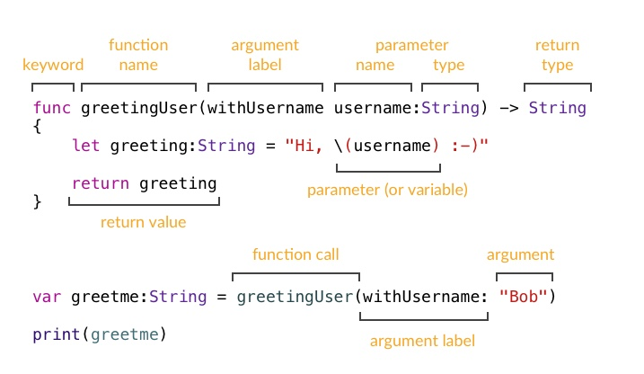

# iOS Workshop
This workshop will walk you through some very basic Swift and help you explore Xcode, storyboards, and view controllers. This will be self-paced. 
## Swift Fundamentals
Open 

### `let` vs. `var`
There are two ways you can initialize a variable: using `let` and `var`

`let` makes the value *immutable*, meaning it cannot be changed after it has been initialized

`var` makes the value *mutable* -- you can reassign this variable as many times as you want.

```swift
var myNum = 1
myNum = 2 + 3
print(myNum)  // 5

let myImmutableNum = 1
myImmutableNum = 2 + 3 // ??
```
> <strong>Exercise 1</strong>: What happens if you try to reassign a `let` variable?

### Data types
#### Integers
Integers are a primitive value type that represents a non-fractional number. This means only whole numbers. All mathematical operations with integers will result in an integer.
```swift
let myInteger: Int = 1
print(myInteger - 1) // 0
```
> <strong>Exercise 2</strong>: What happens if you divide `myInteger` with 2?
#### Floats
Floats are a primitive value type that represents a fractional number. Any math with floats will result in a float.
```swift
let myFloat: CGFloat = 1.0
print(myFloat / 2) // 0.5
```
#### Boolean
Boolean is a value type that can only hold `true` or `false`.
```swift
let myBool: Bool = myFloat > 0.5
print(myBool) // true
```
#### Strings
Strings are any series of characters.
```swift
let myStr = "My name is Angelica"
print(myStr) // "My name is Angelica"
```
You can add them together
```swift
let firstPart = "Hello"
let secondPart = "Angelica"
let fullStr = firstPart + ", " + secondPart 
print(fullStr) // Hello, Angelica
```

You can pull substrings from them
```swift
let myString = "Hello everyone"
let subStr = myString.prefix(5) // Hello
let otherSubStr = myString.suffix(8) // everyone
```
> <strong>Exercise 3</strong>: Print out a string that says "Hello, world!"
### Collection Types
There are several ways to represent a collection of data -- two of them being Arrays and Dictionaries.
#### Arrays
Arrays are a basic collection type. You can define the type of object that is allowed to be stored within it. The order you place items in the array will matter.

```swift
//Different ways to initialize an array of strings
let arr1: [String] = ["Foo", "Bar", "Baz"]
let arr2: Array<String> = ["Foo", "Bar", "Baz"]
let arr3 = ["Foo", "Bar", "Baz"]
```

It looks like a series of objects, but what it really looks like under the hood:

| Index | Item |
|---|---|
| 0 | Foo |
| 1 | Bar |
| 2 | Baz |

To access items in the array, you can use an item's index. 

*Remember, indices start with 0*
```swift
let arr = ["First", "Second", "Third", "Fourth"]
print(arr[1]) // Second
```

You can inspect properties of the array, and use function provided.

You can find the number of elements by calling `count`.
```swift
let arr = ["First", "Second", "Third", "Fourth"]
print(arr.count) // 4
```

You can check if an array is empty by using `isEmpty`
```swift
let arr = ["First", "Second", "Third", "Fourth"]
print(arr.isEmpty) // false
```

You can find the first element using `first`
```swift
let arr = ["First", "Second", "Third", "Fourth"]
print(arr.first) // "First"
```

You can find the last element using `last`
```swift
let arr = ["First", "Second", "Third", "Fourth"]
print(arr.last) // "Fourth"
```

You can find a random element using `randomElement`
```swift
let arr = ["First", "Second", "Third", "Fourth"]
let random = arr.randomElement()
```
<blockquote> 
<strong>Exercise 4</strong>: Print out an array that includes several countries (You pick the places!)  

<strong>Exercise 5</strong>: Print out the number of items in your array

</blockquote>

#### Dictionaries
Dictionaries are another collection type, but you can define the key yourself. Also, *order does not matter and cannot be guaranteed.*

```swift
let dictionary1: [String: String] = ["Item1": "Foo",
                                     "Item2": "Bar",
                                     "Item3": "Baz"]
let dictionary2: [String: Bool] = ["Item1": true,
                                   "Item2": false,
                                   "Item3": true]
```

You can access items from the dictionary through it's key

```swift
let dictionary = ["Foo": 5,
                  "Bar": 3,
                  "Baz": 8]
print(dictionary["Bar"]) // 3
```

You can use the `keys` property of a dictionary to access all the keys in the dictionary or the `values` property to access all the values in the dictionary. 

```swift
let dictionary = ["Foo": 5,
                  "Bar": 3,
                  "Baz": 8]

print(dictionary.keys)
print(dictionary.values)
```
`keys` and `values` can be iterated over like arrays.

## Loops and Functions
### For-loops
```swift
for item in arrayOfThings {
    print(item)
}

for i in 0...5 {
    print(i)
}

for j in 0..<6 {
    print(j)
}

for (key, value) in dictionaryOfThings {
    print("Key: \(key), Value: \(value))
}
```
> <strong>Exercise 6</strong>: Use a for-loop to print out "Hello, __!" for each place in your array from Exercise 4

### Functions
Functions are a great way to compartmentalize code into chunks.

### Anatomy of a function


A great use of functions is to be able to reuse the code based on patterns.

```swift
func sumOf(_ a: Int, _ b: Int) -> Int {
    return a + b
}

let result = sumOf(3, 4) // 7
```

If you don't need to return a value, you can return `Void` or not include a return type.
```swift
func printHello(with name: String) {
    print("Hello, \(name)!")
}

printHello(with: "Angelica") // Hello, Angelica!
```

If you don't need to provide any arguments, you can leave the values empty in the parentheses.

```swift
func printHelloWorld() {
    print("Hello, World!")
}

printHelloWorld() // Hello, World!
```

> <strong>Exercise 7</strong>: Create a function that takes an array of places and returns "Hello, ___!", filling the blank with a random element of the given array.

### [Learn more Swift](https://docs.swift.org/swift-book/LanguageGuide/TheBasics.html)

## Storyboards
